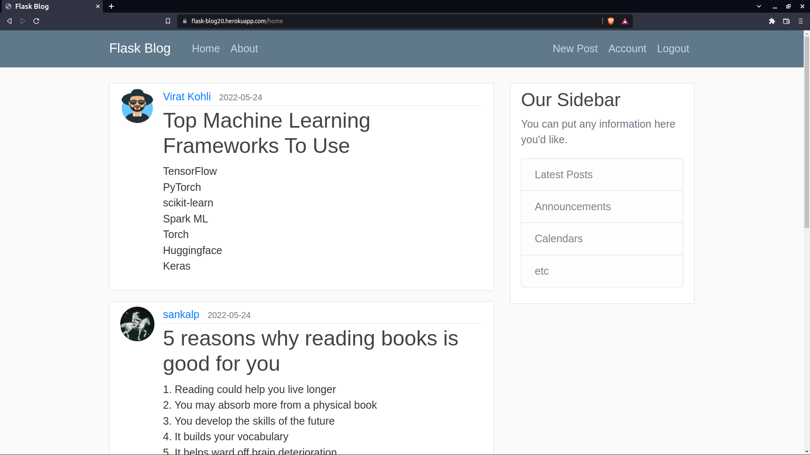
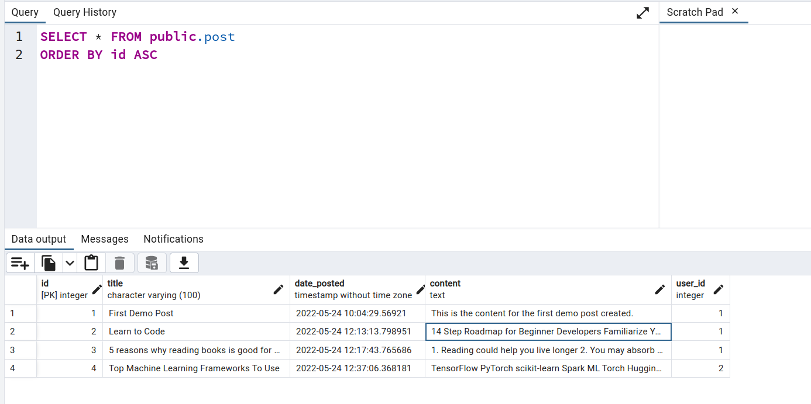
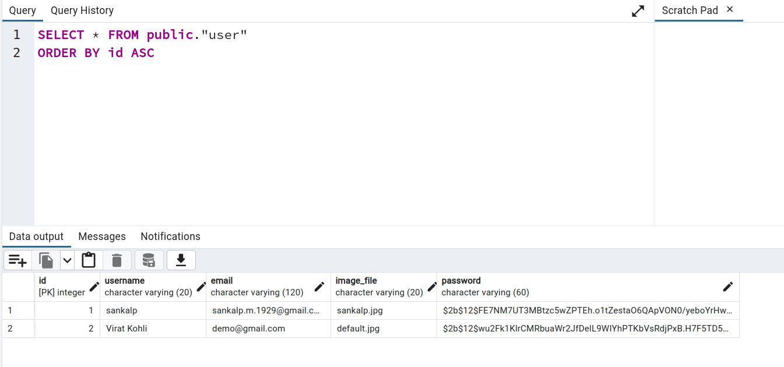

# Blogging Site
Using ORM features of Flask-SQLAlchemy to create a website for users to publish posts.

## Features

- User Authentication
- Email and Password Reset
- Profile Picture Updation
- Pagination

## Demo

<figure>
    <figcaption><h3>Home Page</h3></figcaption>
    
    
</figure>

<figure>
    <figcaption><h3>post table structure</h3></figcaption>
    
    
</figure>

<figure>
    <figcaption><h3>user table structure</h3></figcaption>
    
    
</figure>

## Deployment

Web App: **Heroku** 
Database: **Heroku Postgres** 
